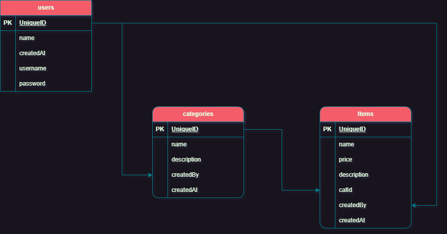

# EtarChallenge
### Etar Platform, E-commerce Backend Development Challenge


## Used Packages
```
FluentValidation
Authentication.JwtBearer
EntityFrameworkCore
```
## Default User
```
Username : admin
Password : admin
```

## Database Migration & App Serve
```
Apply database migration and update the database:
$ dotnet ef database update

Drop database and remove all associated data:
$ dotnet ef database drop

Serve the Application (watch mode):
$ dotnet watch run
```

## Project Structure
```
│
├── Controllers
├── Data
│   ├── Migrations // Database migration files
│   └── DataContext.cs  // Database context class
├── Dto // Data Transfer Objects classes
├── Models // Entity models
├── Properties // Project properties
├── Services // Business logic services
│   │
│   └──> ServiceName ├──> Service Class 
│                    └──> Service Interface
├── Validations // Data validation classes
├── appsettings.json // Configuration file
├── Program.cs // Entry point of the application
└── other project files
```

<div align="center">
    ### Database Structure Diagram ####
    
</div>